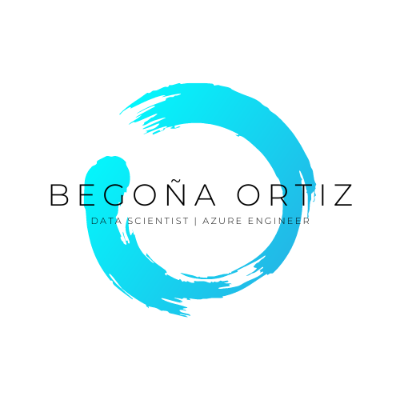

  

  

## Quién soy
Soy Begoña, ingeniero de IA certificada por Microsoft en Azure con conocimientos en análisis y visualización de datos, NLP, Computer Vision y Azure Cognitive Services. He trabajado en proyectos interesantes y busco constantemente nuevas oportunidades para aplicar mis habilidades.

## Habilidades Técnicas

 

  

  
  
  
  
  

  

  

  

  
  
 
  
 
  
  
  

## Projectos
¡No te pierdas mis otros proyectos en la sección de Proyectos de mi perfil de GitHub! Mientras tanto, echa un vistazo a mi último proyecto: un analizador de CV para reclutadores de RRHH. ¡Te sorprenderá lo que puede hacer!
<!-- Crea una tabla con dos columnas y agrega títulos a las columnas -->
| Proyecto | Descripción |
|:---:|:---|
| <!-- Agrega la imagen del proyecto en la primera columna -->  | <!-- Agrega la descripción del proyecto en la segunda columna --> **cv-app**: Este es un analizador de CV que utiliza técnicas de procesamiento de lenguaje natural para extraer información relevante de los currículums y ayudar a los reclutadores a tomar decisiones informadas. |
  
  ## Contacto
     
  

  Última actualización: 23 de mayo de 2023

